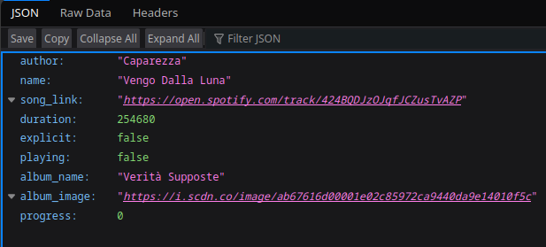

# reloia_listen

Node.js API to get what I'm currently playing on spotify and other music related stuff

# Installation

    cd /path/to/reloia_listen
    npm install

# Usage

    node index.js

### Login

To login to spotify and load the current playing song, you need to access the following URL:

    /log-in

After logging in, you will be redirected to / and everything should start working.

